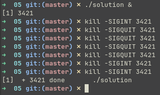
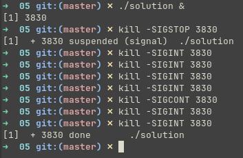
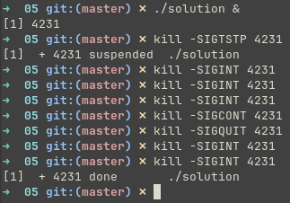
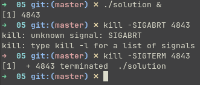
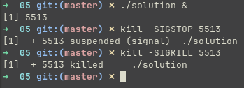

# Задание 05 (Сигналы)

## Условие

Написать программу, бесконечно выводящую в файл 1 раз в секунду значение внутреннего счетчика (1 2 3 ...). Программа должна завершаться после третьего сигнала `SIGINT`. При получении сигнала `SIGINT` или `SIGQUIT` в файл записывается строка, что получен и обработан сигнал (использовать одну функцию-обработчик сигнала). Не забывайте закрывать файл!

Запустить программу в фоновом режиме (`myprogram &`). Узнать идентификатор процесса и протестировать команды управления (`SIGINT`, `SIGQUIT`, `SIGABRT`, `SIGKILL`, `SIGTERM`, `SIGTSTP`, `SIGSTOP`, `SIGCONT`). Для сдачи задания нужно прислать исходный код программы и скриншоты с комментариями (что тестируется, какой результат вы ожидаете и что фактически получилось).

## Сборка

```shell
make solution
```

## Запуск

> `FILE` - Файл для вывода лога, по умолчанию - `out.txt`

`./solution [FILE]`

```shell
./solution out.txt
```

## Тестирование

### `SIGINT`, `SIGQUIT`

Запустим программу в фоновом режиме `./solution &`, отправим команды управления `SIGINT` и `SIGQUIT`



В результате получим файл `out.txt`:
```txt
1
2
3
4
5
6
7
8
9
10
11
12
13
14
15
SIGINT recieved
16
17
18
19
20
21
22
23
SIGQUIT recieved
24
25
SIGQUIT recieved
26
SIGQUIT recieved
27
SIGQUIT recieved
28
29
SIGINT recieved
30
31
SIGINT recieved
```

Программа записывает полученные сигналы, а при получении 3-го сигнала `SIGINT`, завершает работу

### `SIGSTOP`, `SIGCONT`, `SIGINT`

Запустим программу в фоновом режиме `./solution &`, отправим команды управления `SIGSTOP`, `SIGCONT` и `SIGINT`



В результате получим файл `out.txt`:
```txt
1
2
3
4
5
6
7 # <-- SIGSTOP
SIGINT recieved
8
9
10
11
12
13
14
15
16
SIGINT recieved
17
SIGINT recieved
```

Программа была приостановлена сигналом `SIGSTOP`, при этом во время приостановки сигналы `SIGINT` игнорировались. При получении сигнала `SIGCONT`, программа продолжила работу, обработав только 1 сигнал `SIGINT`, полученный во время приостановки.

### `SIGTSTP`, `SIGCONT`, `SIGQUIT`, `SIGINT`

Запустим программу в фоновом режиме `./solution &`, отправим команды управления `SIGTSTP`, `SIGCONT`, `SIGQUIT` и `SIGINT`



В результате получим файл `out.txt`:
```txt
1
2
3
4
5
6
7
8
9 # <-- SIGTSTP
SIGINT recieved
10
11
12
13
14
15
16
17
SIGQUIT recieved
18
19
SIGINT recieved
20
SIGINT recieved
```

Программа продемонстрировала такое же поведение при сигнале `SIGTSTP`, как и при сигнале `SIGSTOP`.

### `SIGABRT`, `SIGTERM`

Запустим программу в фоновом режиме `./solution &`, отправим команды управления `SIGABRT` и `SIGTERM`.



В результате получим файл `out.txt`:
```txt
1
2
3
4
5
6
7
8
9
10
11
12
13
```

Сигнал `SIGABRT` отсутствует на используемой системе, сигнал `SIGTERM` завершает процесс.

### `SIGSTOP`, `SIGTERM`, `SIGCONT`

Запустим программу в фоновом режиме `./solution &`, отправим команды управления `SIGSTOP`, `SIGTERM` и `SIGCONT`.


В результате получим файл `out.txt`:
```txt
1
2
3
4
5
6
```

Сигнал `SIGTERM` игнорируется пока процесс приостановлен и обрабатывается только после получения сигнала `SIGCONT`.

### `SIGSTOP`, `SIGKILL`

Запустим программу в фоновом режиме `./solution &`, отправим команды управления `SIGSTOP` и `SIGKILL`.



В результате получим файл `out.txt`:
```txt
1
2
3
4
5
6
```

Сигнал `SIGKILL` принудительно завершает процесс даже если он приостановлен сигналом `SIGSTOP`, не дожидаясь его возобновления.
