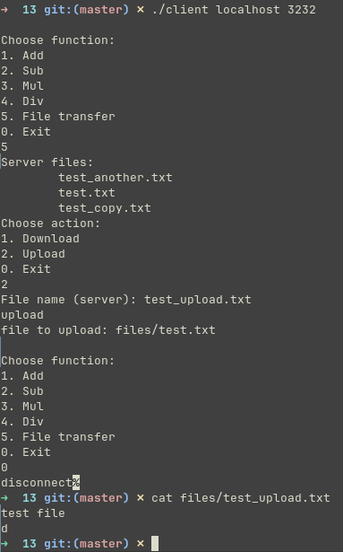
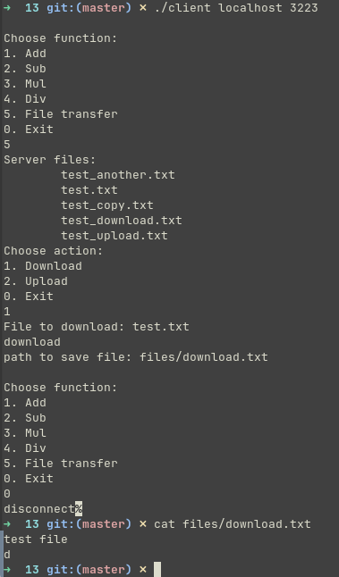

# Задание 13 (TCP сокеты)

## Условие

Отладить программы ТСP-клиента и сервера из лекции.

Добавить возможность вычисления разности, произведения, частного двух чисел. Необходимое математическое действие указывает клиент.

Добавить возможность передачи файлов.

## Сборка

### Сервер

```shell
make server
```

### Клиент

```shell
make client
```

## Запуск

### Сервер

`./server PORT`

```shell
./server 3232
```

### Клиент

`./client HOSTNAME PORT`

```shell
./client localhost 3232
```

## Тестирование




