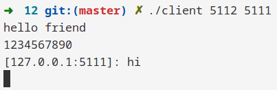
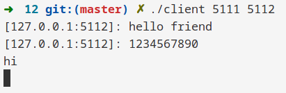
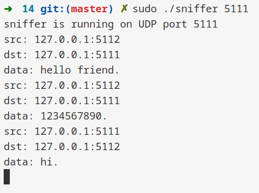
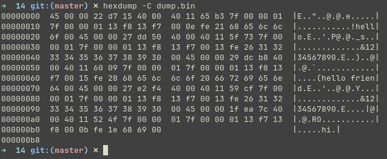

# Задание 14 (RAW сокеты)

## Условие

Написать программу, получающую копии пакетов, предназначенных приложению-серверу из задачи 12 (снифер).

Программа может формировать дамп данных, который нужно вручную проанализировать (просмотр бинарных файлов) и убедиться, что это действительно информация от программы-клиента.

Можно дополнить программу так, чтобы она расшифровывала и выводила в файл или на экран полученные сообщения.

## Сборка

```shell
make sniffer
```

## Запуск

> Требует права суперпользователя

`./sniffer PORT`

```shell
./sniffer 51111
```

## Тестирование







> В сноске справа можно заметить сообщения из чата


