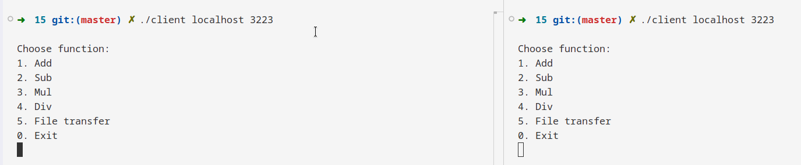
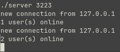
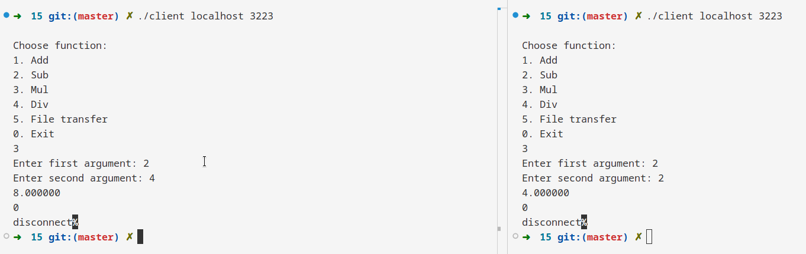
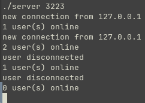

# Задание 15 (Мультиплексирование)

## Условие

Реализовать программу-сервер, написанную при решении задачи 13, с использованием мультиплексирования ввода-вывода и одного потока исполнения.

Можно применить любую функцию (`select`/`poll`/`epoll`).

> Для реализации была использована функция `poll`

## Сборка

### Сервер

```shell
make server
```

### Клиент

```shell
make client
```

## Запуск

### Сервер

`./server PORT`

```shell
./server 3232
```

### Клиент

`./client HOSTNAME PORT`

```shell
./client localhost 3232
```

## Тестирование

Запустим сервер на порту 3223


Запустим 2 клиентов и подключимся к серверу



Сервер принял соединение сразу 2 клиентов в одном потоке исполнения и может обрабатывать их запросы





