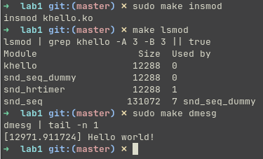

# Задание 1

## Условие

Написать модуль ядра `Hello World` для своей версии ядра:
- Поменять описание модуля
- Добавить себя как автора
- Придумать свою лицензию

> Результаты выложить на `github` или др. общедоступный `git`. Cсылку на `git` выслать в ЛС для проверки.

> Скрины запуска модуля не забываем.

## Сборка

### Модуль

```shell
make
```

### Clang

> Создание файла `compile_commands.json` для clangd (для корректной работы IntelliSense)

```shell
make clang
```

### Очистка

```shell
make clean
make clean-clang
```

## Использование

### Загрузка (включение) модуля

> Требует права суперпользователя

```shell
make insmod
```

### Выгрузка (выключение) модуля

> Требует права суперпользователя

```shell
make rmmod
```

### Поиск модуля в списке загруженных

```shell
make lsmod
```

### Просмотр сообщений в логе ядра

> Требует права суперпользователя

```shell
make dmesg
```

## Проверка работы

> Версия ядра системы, используемой для тестирования: `6.17.9-arch1-1`

### Сборка модуля


### Загрузка (включение) модуля



### Выгрузка (выключение) модуля


