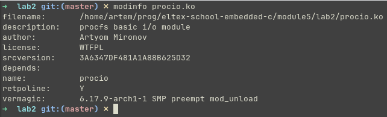
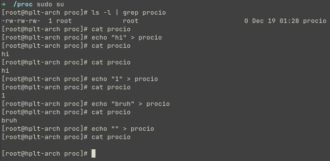
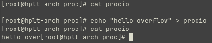
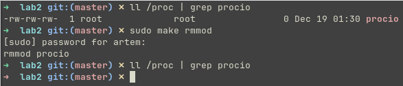

# Задание 2

## Условие

Написать модуль ядра для своей версии ядра, который будет обмениваться информацией с `userspace` через `proc`. Адаптировать для своей версии ядра (Структура обработчиков). Избавиться от хардкода (маг чисел) и изолировать переменные модуля (`static`).

> Результаты выложить на `github` или др. общедоступный `git`. Cсылку на `git` выслать в ЛС для проверки.

> Скрины запуска, работы и тестирования работы модуля прилагаем.

## Сборка

### Модуль

```shell
make
```

### Clang

> Создание файла `compile_commands.json` для clangd (для корректной работы IntelliSense)

```shell
make clang
```

### Очистка

```shell
make clean
make clean-clang
```

## Использование

### Загрузка (включение) модуля

> Требует права суперпользователя

```shell
make insmod
```

### Выгрузка (выключение) модуля

> Требует права суперпользователя

```shell
make rmmod
```

## Проверка работы

> Версия ядра системы, используемой для тестирования: `6.17.9-arch1-1`

### Сборка и включение модуля


### Информация о модуле



### Запись и чтение в `procfs`



### Тестирование переполнения



### Выключение модуля


