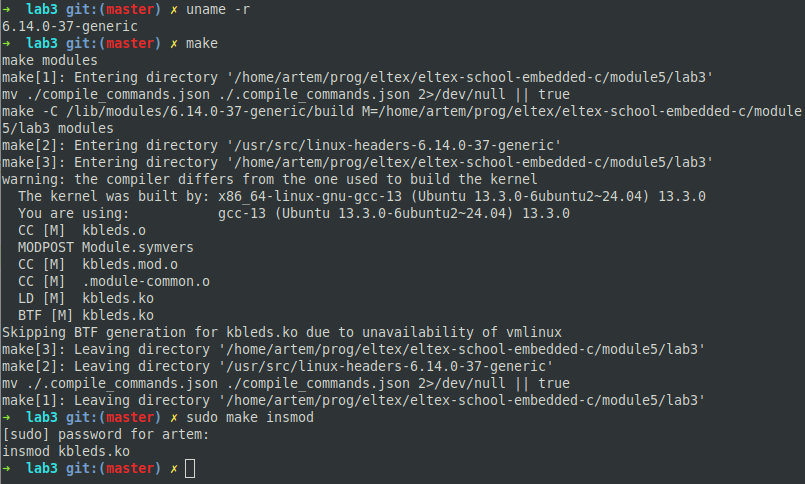
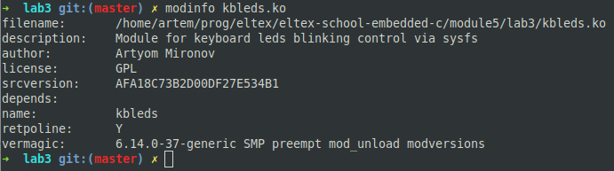
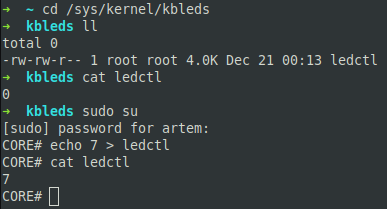
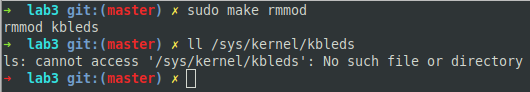

# Задание 3

## Условие

Используя исходники модуля ядра:
- `https://pastebin.com/r46SDJzs`
- `https://pastebin.com/qEKTZZcB`

Сделать мигание лампочек на клавиатуре используя `ioctl`. Управлением миганием сделать через `sysfs`.

К примеру если записать в переменную в `sysfs` значение `1` горит первая лампочка,  `2` горит вторая, `4` горит третья и т.д., `7` - все.

Значение - это двоичная маска `1`(`001`) `2`(`010`) `7`(`111`).

> Результаты выложить на `github` или др. общедоступный `git`. Cсылку на `git` выслать в ЛС для проверки.

## Сборка

### Модуль

```shell
make
```

### Clang

> Создание файла `compile_commands.json` для clangd (для корректной работы IntelliSense)

```shell
make clang
```

### Очистка

```shell
make clean
make clean-clang
```

## Использование

### Загрузка (включение) модуля

> Требует права суперпользователя

```shell
make insmod
```

### Выгрузка (выключение) модуля

> Требует права суперпользователя

```shell
make rmmod
```

## Проверка работы

> Версия ядра системы, используемой для тестирования: `6.14.0-37-generic`

### Сборка и включение модуля



### Информация о модуле



### Запись и чтение в `sysfs`



### Выключение модуля

