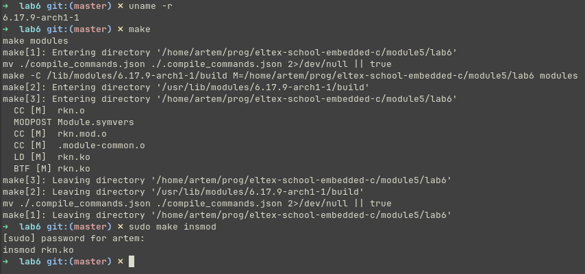
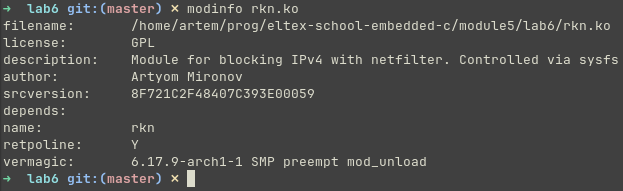
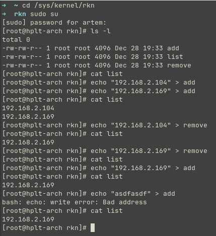
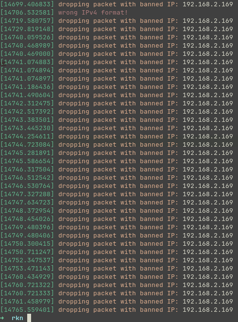
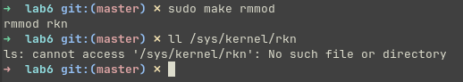

# Задание 6

## Условие

Написать модуль ядра для своей версии ядра, который будет фильтровать исходящие запросы по `ip`. Если адрес есть в списке, то пакет не отправлять.

Cделать добавление, удаление и список черных адресов через `proc` или `sysfs`.

> Результаты выложить на `github` или др. общедоступный `git`. Cсылку на `git` выслать в ЛС для проверки.

## Сборка

### Модуль

```shell
make
```

### Clang

> Создание файла `compile_commands.json` для clangd (для корректной работы IntelliSense)

```shell
make clang
```

### Очистка

```shell
make clean
make clean-clang
```

## Использование

### Загрузка (включение) модуля

> Требует права суперпользователя

```shell
make insmod
```

### Выгрузка (выключение) модуля

> Требует права суперпользователя

```shell
make rmmod
```

## Проверка работы

> Версия ядра системы, используемой для тестирования: `6.17.9-arch1-1`

### Сборка и включение модуля



### Информация о модуле



### Добавление/удаление адресов



### Содержание `dmesg`



### Выключение модуля


